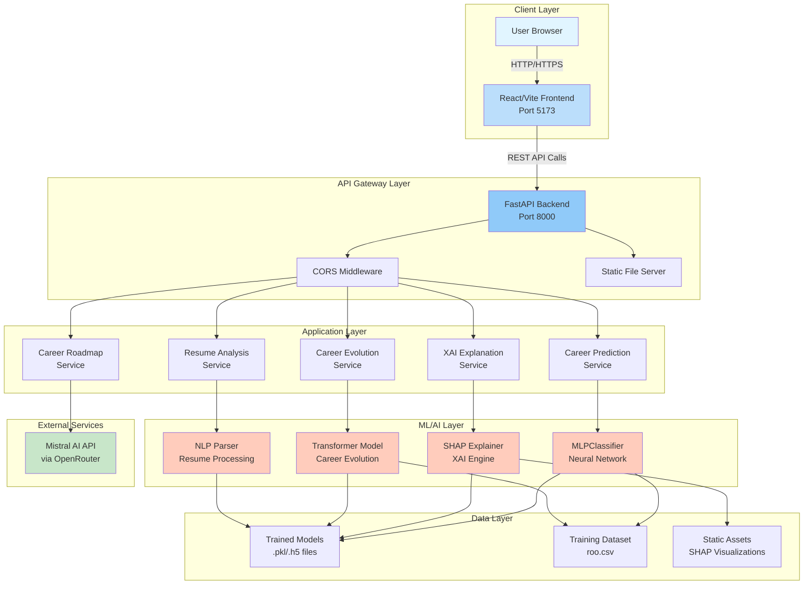
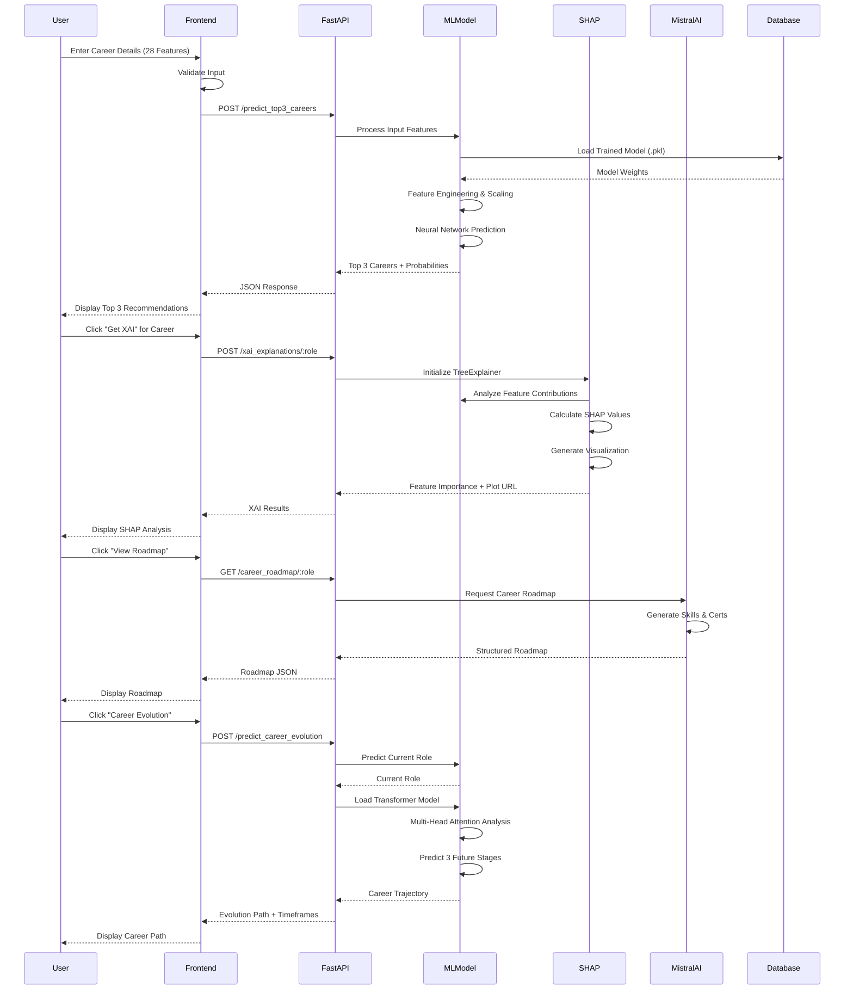
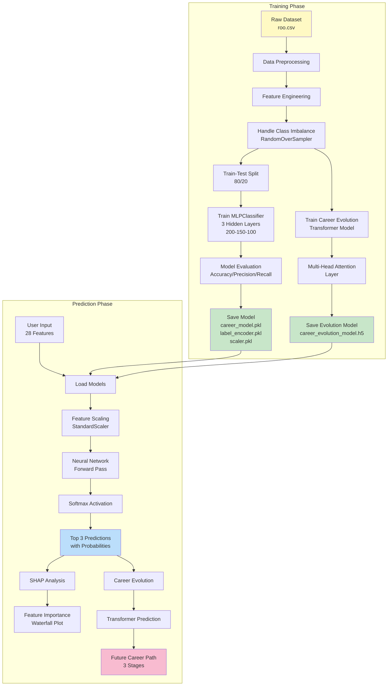
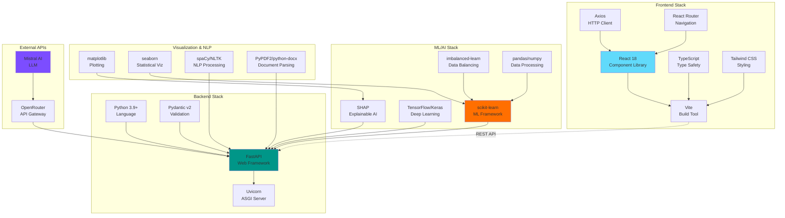
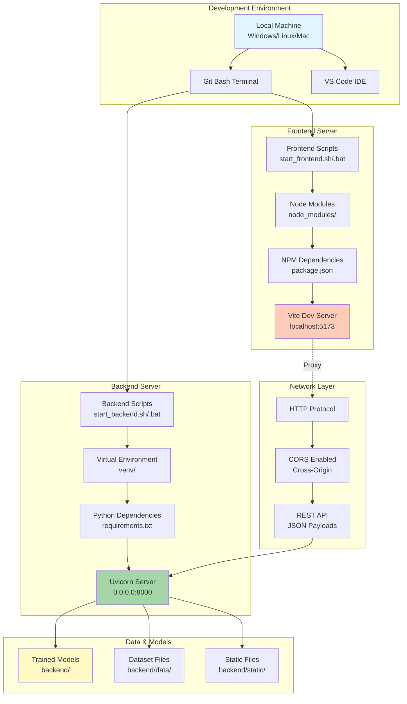
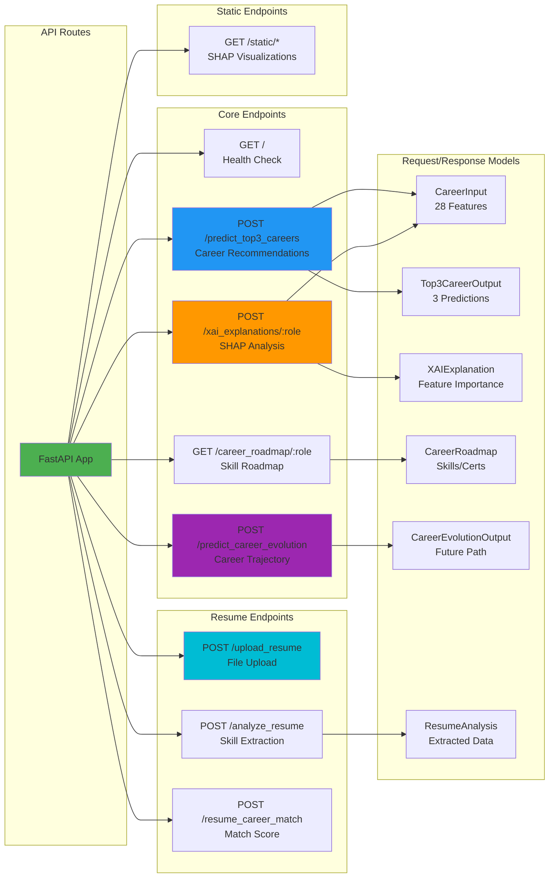
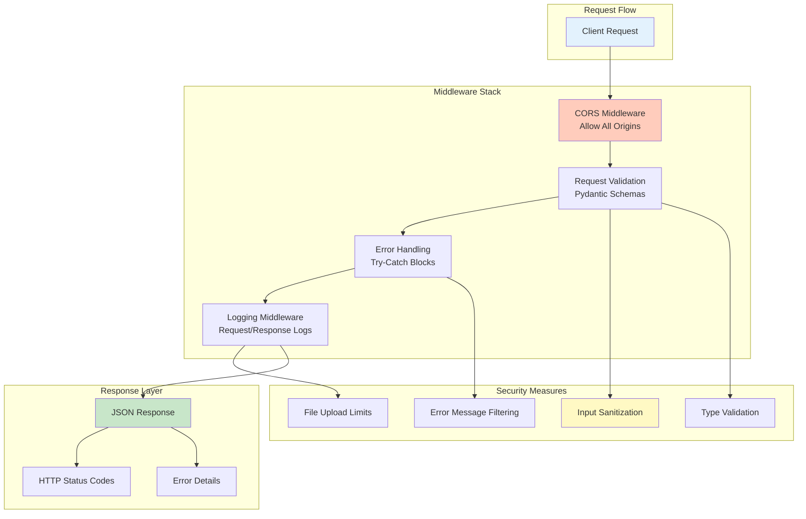
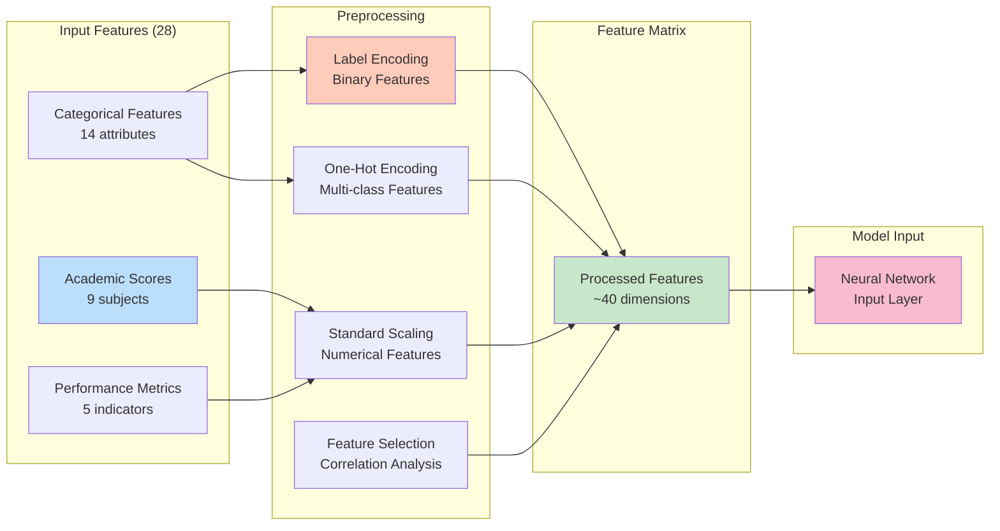
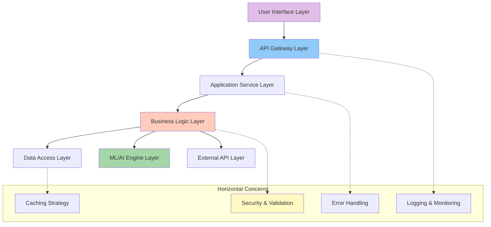

# 🏗️ BrightPath Career Recommendation System - Architecture Diagram

## Overview
This document provides comprehensive system architecture diagrams for the BrightPath Career Recommendation System, including component architecture, data flow, deployment architecture, and technology stack.

---

## 1. High-Level System Architecture



---

## 2. Detailed Component Architecture

```mermaid
graph LR
    subgraph "Frontend Components"
        A1[App.tsx<br/>Main Router]
        A2[LandingPage]
        A3[CareerRecommendation]
        A4[XAIAnalysis]
        A5[CareerRoadmap]
        A6[CareerEvolution]
        A7[ResumeUpload]
        A8[Components<br/>EnhancedRoadmap<br/>SkillGapAnalysis]
    end
    
    subgraph "Backend API Endpoints"
        B1[main.py]
        B2[/predict_top3_careers]
        B3[/xai_explanations/:role]
        B4[/career_roadmap/:role]
        B5[/predict_career_evolution]
        B6[/upload_resume]
        B7[/analyze_resume]
    end
    
    subgraph "Business Logic Modules"
        C1[model.py<br/>ML Predictions]
        C2[xai.py<br/>SHAP Analysis]
        C3[utils.py<br/>Roadmap Gen]
        C4[career_evolution_advanced.py<br/>Transformer Model]
        C5[resume_parser.py<br/>PDF/DOCX Parser]
        C6[resume_analyzer.py<br/>Skill Extraction]
    end
    
    subgraph "Data Models"
        D1[schemas.py<br/>Pydantic Models]
        D2[CareerInput]
        D3[CareerOutput]
        D4[Top3CareerOutput]
        D5[CareerRoadmap]
        D6[CareerEvolutionOutput]
        D7[ResumeAnalysis]
    end
    
    A1 --> A2
    A1 --> A3
    A1 --> A4
    A1 --> A5
    A1 --> A6
    A1 --> A7
    A3 --> A8
    
    A3 -->|API Call| B2
    A4 -->|API Call| B3
    A5 -->|API Call| B4
    A6 -->|API Call| B5
    A7 -->|API Call| B6
    A7 -->|API Call| B7
    
    B1 --> B2
    B1 --> B3
    B1 --> B4
    B1 --> B5
    B1 --> B6
    B1 --> B7
    
    B2 --> C1
    B3 --> C2
    B4 --> C3
    B5 --> C4
    B6 --> C5
    B7 --> C6
    
    B2 --> D2
    B2 --> D4
    B3 --> D2
    B4 --> D5
    B5 --> D6
    B6 --> D7
    
    style A1 fill:#e1bee7
    style B1 fill:#90caf9
    style C1 fill:#ffccbc
    style D1 fill:#fff9c4
```

---

## 3. Data Flow Architecture



---

## 4. Machine Learning Pipeline



---

## 5. Technology Stack Diagram



---

## 6. Deployment Architecture



---

## 7. API Endpoint Architecture



---

## 8. Security & Middleware Layer



---

## 9. Feature Engineering Pipeline



---

## 10. System Integration Overview



---

## Key Features Highlighted

### 🎯 Core Capabilities
- **Career Prediction**: ML-powered top 3 career recommendations with confidence scores
- **Explainable AI**: SHAP-based feature importance visualization
- **Career Evolution**: Transformer-based career trajectory prediction (3 future stages)
- **Career Roadmap**: AI-generated skills, certifications, and project suggestions
- **Resume Analysis**: Automated resume parsing and skill extraction

### 🔧 Technical Highlights
- **Neural Network**: 3-layer MLP (200-150-100 neurons) with ReLU activation
- **Transformer Model**: Multi-head attention for career evolution
- **SHAP Integration**: TreeExplainer for interpretable predictions
- **Data Balancing**: RandomOverSampler to handle class imbalance
- **RESTful API**: FastAPI with Pydantic validation
- **Modern Frontend**: React + TypeScript + Vite + Tailwind CSS

### 📊 Data Processing
- **Input Features**: 28 features across academic, skill, and personality domains
- **Output Classes**: 17+ career categories
- **Training Dataset**: roo.csv with balanced sampling
- **Feature Engineering**: Label encoding, one-hot encoding, standard scaling

---

## How to Use This Document

1. **For Developers**: Reference the component and data flow diagrams for implementation
2. **For Architects**: Use the high-level and deployment diagrams for system design
3. **For Stakeholders**: Focus on the overview and technology stack diagrams
4. **For ML Engineers**: Study the ML pipeline and feature engineering diagrams

---

## Document Information
- **Created**: 2025
- **Version**: 1.0
- **Project**: BrightPath Career Recommendation System
- **Diagram Format**: Mermaid (Markdown-compatible)

To view these diagrams:
1. Open this file in GitHub (automatic rendering)
2. Use VS Code with Mermaid preview extension
3. Use online Mermaid editors (mermaid.live)
4. Use markdown editors that support Mermaid (Obsidian, Notion, etc.)
