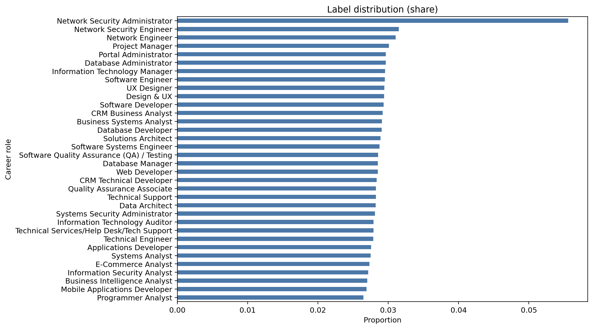
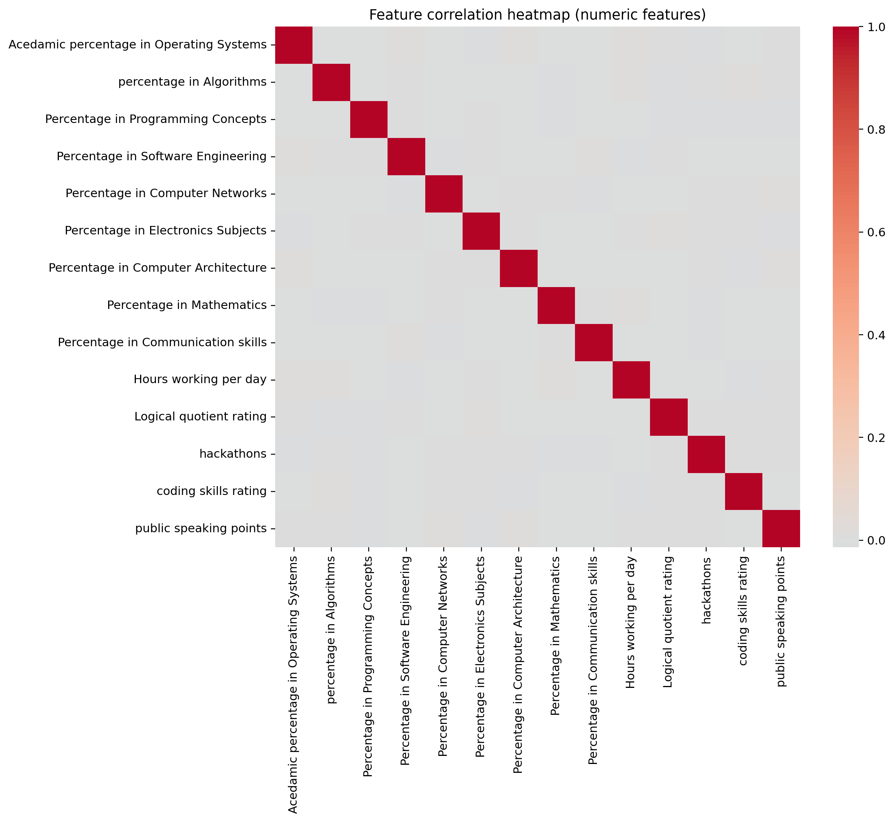
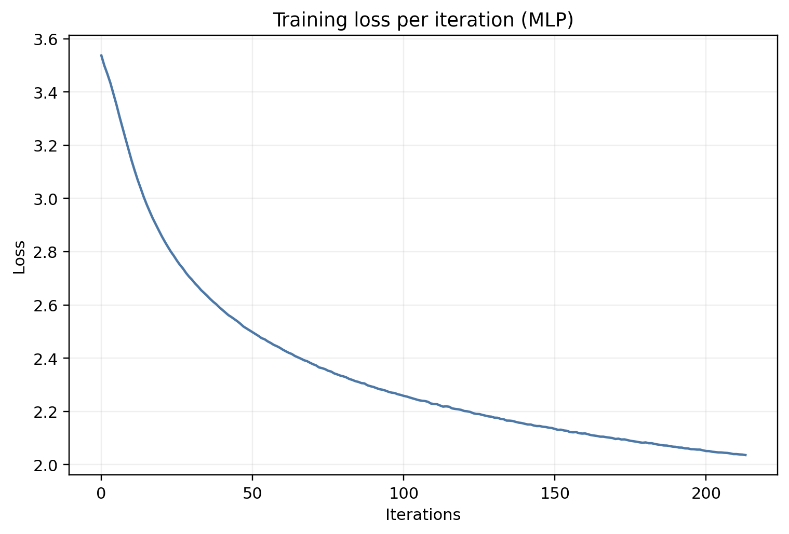
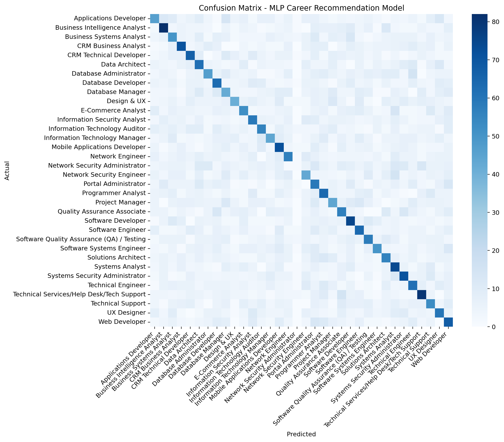
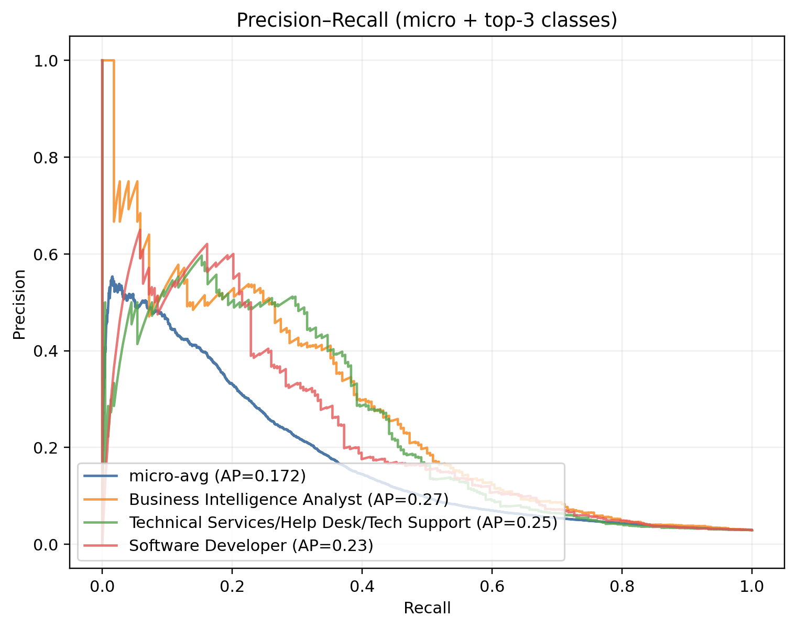
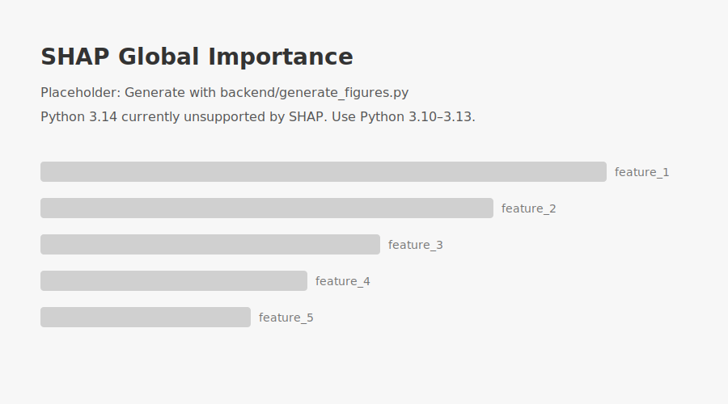
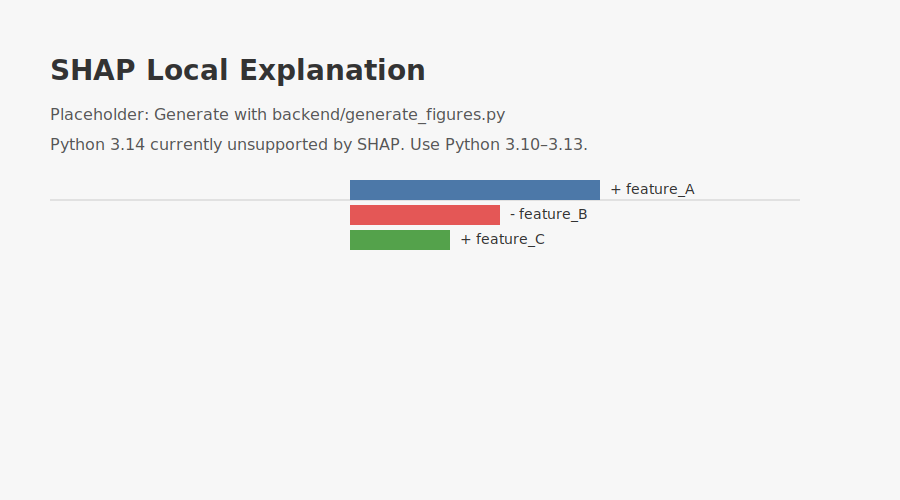

# BrightPath Research Figures# BrightPath Research Figures


This page collects core figures and architecture diagrams for the BrightPath Career Recommendation System. All plots render directly on GitHub. Source images live under `docs/figures`.This page collects core figures for the paper. All plots render directly on GitHub. Source images live under `docs/figures` and can be regenerated with `python backend/generate_figures.py`.


## 📐 System Architecture & Sequence Diagrams## End-to-end system architecture


For comprehensive system architecture and sequence diagrams, see:```mermaid

- **[Complete Architecture Documentation](ARCHITECTURE_DOCUMENTATION.md)** - Detailed technical documentationflowchart LR

- **System Architecture Diagram:** `figures/system_architecture_detailed.mmd`  A[Frontend (Vite/React)] -->|REST/JSON| B[Backend API (FastAPI)]

- **Sequence Diagram:** `figures/sequence_detailed.mmd`  B --> C[Preprocessing\n(Scaling + OneHotEncoder)]

  C --> D[MLP Career Recommender]

### Quick Architecture Overview  D --> E[XAI (SHAP)]

  D --> F[Career Roadmap Generator]

The system follows a layered architecture:  E --> G[Explanations]

1. **Client Layer**: React Frontend (Vite + TypeScript)  F --> H[Roadmap]

2. **API Gateway**: FastAPI Server with CORS  G --> I[(Response)]

3. **Core Services**: Career Prediction, Evolution, XAI, Roadmap, Resume Analysis  H --> I

4. **Data Processing**: Feature Engineering, Encoding, Scaling```

5. **Data Layer**: Models, Datasets, Static Files

## Data distribution and correlation

### Key Technologies

- **Frontend**: React 18, TypeScript, Vite, TailwindCSS

- **Backend**: FastAPI, Python 3.10+

- **ML/AI**: Random Forest, Transformer, LSTM, SHAP

- **NLP**: spaCy, Sentence-BERT (SBERT)

- **Deep Learning**: TensorFlow/Keras## Model architecture and training curve


## 📊 Data Distribution and Correlation```mermaid

graph TD

  In[Input (77 features)] --> L1[Dense 128, ReLU]

  L1 --> L2[Dense 64, ReLU]

  L2 --> Out[Output 34, Softmax]

```

## 📈 Model Training Performance




## Evaluation: Confusion matrix and PR curve

*Training curve showing model convergence over epochs*



## 🎯 Model Evaluation Metrics



### Confusion Matrix

## Explainability (XAI)


*Multi-class classification performance matrix*


### Precision-Recall Curve


## Career roadmap graph (concept)

*Precision-Recall tradeoff analysis*

```mermaid

## 🔍 Explainable AI (XAI) Visualizationsflowchart LR

  Start([Current Role/Skillset]) --> S1[Upskill: Algorithms + DSA]

### Global Feature Importance  S1 --> S2[Cert: Cloud Fundamentals]

  S2 --> S3[Project: CRUD Web App]

  S3 --> S4[Cert: DB Design]

*Global SHAP feature importance showing which features matter most across all predictions*  S4 --> Goal([Target Role: Software Engineer])

```

### Local Explanation

Notes

- The model diagram reflects the training script configuration; exact sizes may change with new training runs.

*Individual prediction explanation showing how features influenced a specific career recommendation*- SHAP placeholders are shown if your Python environment doesn’t support SHAP (Python 3.14+). To generate the real plots, run `python backend/generate_figures.py` in Python 3.10–3.13.


## 🎓 Model Architecture

### Career Prediction Model (Random Forest)
- **Input**: 28 features (academic scores, skills, preferences)
- **Algorithm**: Random Forest Classifier
- **Output**: 34 career classes with probability scores
- **Features**:
  - Academic percentages (8 subjects)
  - Skill ratings (coding, logical quotient, public speaking)
  - Preferences (work type, company type, career area)
  - Additional metrics (hackathons, workshops, certifications)

### Career Evolution Model (Transformer)
- **Architecture**: Transformer with Multi-Head Attention
- **Input**: Current role + 28 user features
- **Output**: 3 future career stages with personalized timeframes
- **Fallback**: LSTM model for reliability
- **Time Prediction**: Separate neural network for personalized timeframes

### Resume Analysis (NLP + SBERT)
- **Text Processing**: spaCy NLP pipeline
- **Semantic Matching**: Sentence-BERT embeddings
- **Entity Extraction**: Name, email, skills, education, experience
- **Similarity Calculation**: Cosine similarity on embeddings
- **Output**: Match score, gap analysis, recommendations

## 📝 Notes

- All diagrams and figures are version-controlled in the `docs/figures/` directory
- Mermaid diagrams can be viewed using the [Mermaid Live Editor](https://mermaid.live/)
- Machine learning visualizations are generated during model training
- SHAP plots are dynamically generated for each XAI request
- For detailed architecture documentation, see [ARCHITECTURE_DOCUMENTATION.md](ARCHITECTURE_DOCUMENTATION.md)

## 🔄 Generating Figures

To regenerate ML/AI visualizations:
```bash
cd backend
python generate_figures.py
```

This will create/update:
- `data_distribution.png`
- `correlation_heatmap.png`
- `training_curve.png`
- `confusion_matrix.png`
- `pr_curve.png`

SHAP plots are generated on-demand when users request XAI analysis.
