# BrightPath Diagrams (GitHub-rendered)

Below are all diagrams embedded as Mermaid code blocks so they render directly on GitHub. The original editable sources remain in `docs/figures/*.mmd`.

---

## 01. System Block Diagram

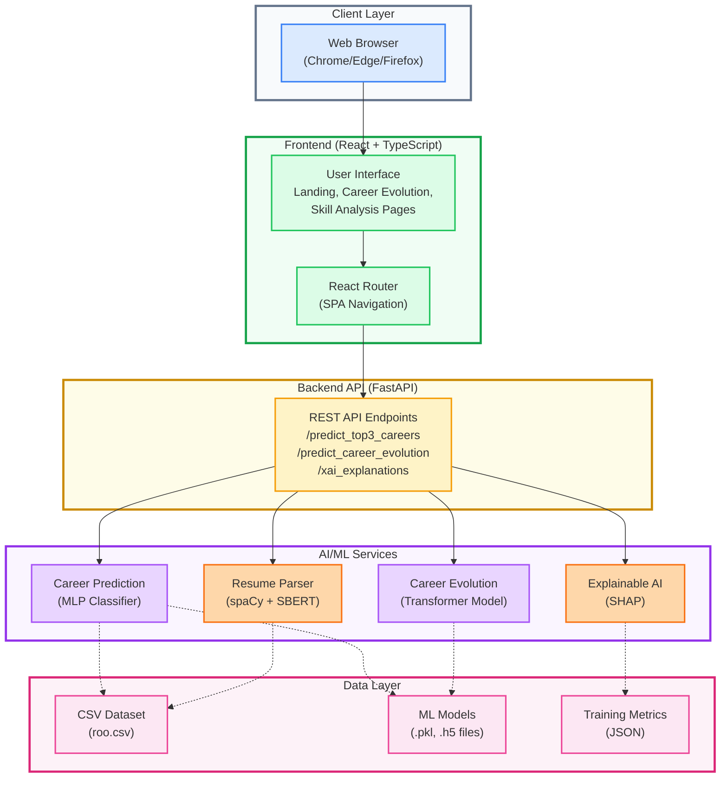
```mermaid
graph TB
    %% BrightPath System Architecture - Block Diagram
    
    subgraph Client["Client Layer"]
        Browser["Web Browser<br/>(Chrome/Edge/Firefox)"]
        style Browser fill:#dbeafe,stroke:#3b82f6,stroke-width:2px
    end
    
    subgraph Frontend["Frontend (React + TypeScript)"]
        UI["User Interface<br/>Landing, Career Evolution,<br/>Skill Analysis Pages"]
        Router["React Router<br/>(SPA Navigation)"]
        style UI fill:#dcfce7,stroke:#22c55e,stroke-width:2px
        style Router fill:#dcfce7,stroke:#22c55e,stroke-width:2px
    end
    
    subgraph Backend["Backend API (FastAPI)"]
        API["REST API Endpoints<br/>/predict_top3_careers<br/>/predict_career_evolution<br/>/xai_explanations"]
        style API fill:#fef3c7,stroke:#f59e0b,stroke-width:2px
    end
    
    subgraph Services["AI/ML Services"]
        MLP["Career Prediction<br/>(MLP Classifier)"]
        Transformer["Career Evolution<br/>(Transformer Model)"]
        XAI["Explainable AI<br/>(SHAP)"]
        NLP["Resume Parser<br/>(spaCy + SBERT)"]
        style MLP fill:#e9d5ff,stroke:#a855f7,stroke-width:2px
        style Transformer fill:#e9d5ff,stroke:#a855f7,stroke-width:2px
        style XAI fill:#fed7aa,stroke:#f97316,stroke-width:2px
        style NLP fill:#fed7aa,stroke:#f97316,stroke-width:2px
    end
    
    subgraph Data["Data Layer"]
        Dataset["CSV Dataset<br/>(roo.csv)"]
        Models["ML Models<br/>(.pkl, .h5 files)"]
        Metrics["Training Metrics<br/>(JSON)"]
        style Dataset fill:#fce7f3,stroke:#ec4899,stroke-width:2px
        style Models fill:#fce7f3,stroke:#ec4899,stroke-width:2px
        style Metrics fill:#fce7f3,stroke:#ec4899,stroke-width:2px
    end
    
    Browser --> UI
    UI --> Router
    Router --> API
    
    API --> MLP
    API --> Transformer
    API --> XAI
    API --> NLP
    
    MLP -.-> Dataset
    MLP -.-> Models
    Transformer -.-> Models
    XAI -.-> Metrics
    NLP -.-> Dataset
    
    style Client fill:#f8fafc,stroke:#64748b,stroke-width:3px
    style Frontend fill:#f0fdf4,stroke:#16a34a,stroke-width:3px
    style Backend fill:#fefce8,stroke:#ca8a04,stroke-width:3px
    style Services fill:#faf5ff,stroke:#9333ea,stroke-width:3px
    style Data fill:#fdf2f8,stroke:#db2777,stroke-width:3px
```

---

## 02. Hardware Architecture

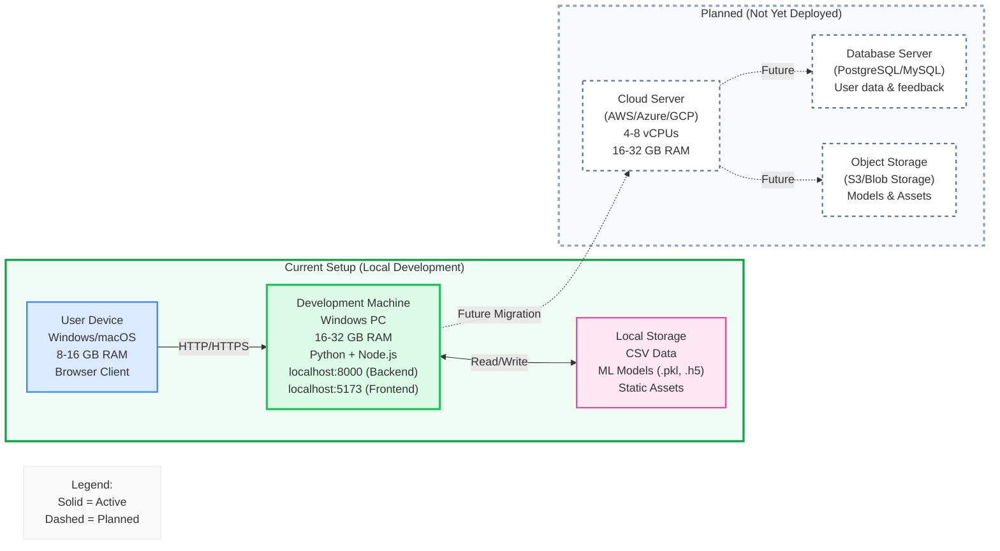
```mermaid
graph LR
    %% Hardware Architecture (Current Local + Planned Cloud)
    
    subgraph Current["Current Setup (Local Development)"]
        User["User Device<br/>Windows/macOS<br/>8-16 GB RAM<br/>Browser Client"]
        Dev["Development Machine<br/>Windows PC<br/>16-32 GB RAM<br/>Python + Node.js<br/>localhost:8000 (Backend)<br/>localhost:5173 (Frontend)"]
        Files["Local Storage<br/>CSV Data<br/>ML Models (.pkl, .h5)<br/>Static Assets"]
        
        style User fill:#dbeafe,stroke:#3b82f6,stroke-width:2px
        style Dev fill:#dcfce7,stroke:#22c55e,stroke-width:3px
        style Files fill:#fce7f3,stroke:#ec4899,stroke-width:2px
    end
    
    subgraph Planned["Planned (Not Yet Deployed)"]
        Cloud["Cloud Server<br/>(AWS/Azure/GCP)<br/>4-8 vCPUs<br/>16-32 GB RAM"]
        DB["Database Server<br/>(PostgreSQL/MySQL)<br/>User data & feedback"]
        Storage["Object Storage<br/>(S3/Blob Storage)<br/>Models & Assets"]
        
        style Cloud fill:#ffffff,stroke:#64748b,stroke-width:2px,stroke-dasharray: 5 5
        style DB fill:#ffffff,stroke:#64748b,stroke-width:2px,stroke-dasharray: 5 5
        style Storage fill:#ffffff,stroke:#64748b,stroke-width:2px,stroke-dasharray: 5 5
    end
    
    User -->|HTTP/HTTPS| Dev
    Dev <-->|Read/Write| Files
    
    Dev -.->|Future Migration| Cloud
    Cloud -.->|Future| DB
    Cloud -.->|Future| Storage
    
    style Current fill:#f0fdf4,stroke:#16a34a,stroke-width:3px
    style Planned fill:#f8fafc,stroke:#94a3b8,stroke-width:3px,stroke-dasharray: 5 5
    
    Legend["Legend:<br/>Solid = Active<br/>Dashed = Planned"]
    style Legend fill:#fafafa,stroke:#e5e7eb,stroke-width:1px
```

---

## 03. Software Layers

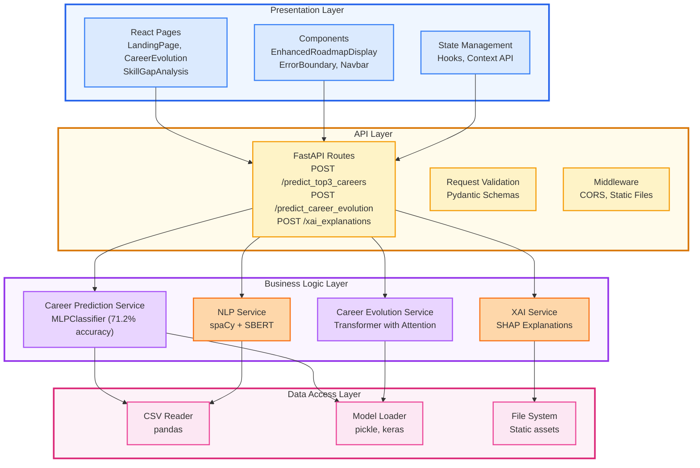
```mermaid
graph TD
    %% Software Architecture - Layered View
    
    subgraph Layer1["Presentation Layer"]
        P1["React Pages<br/>LandingPage, CareerEvolution<br/>SkillGapAnalysis"]
        P2["Components<br/>EnhancedRoadmapDisplay<br/>ErrorBoundary, Navbar"]
        P3["State Management<br/>Hooks, Context API"]
        
        style P1 fill:#dbeafe,stroke:#3b82f6,stroke-width:2px
        style P2 fill:#dbeafe,stroke:#3b82f6,stroke-width:2px
        style P3 fill:#dbeafe,stroke:#3b82f6,stroke-width:2px
    end
    
    subgraph Layer2["API Layer"]
        A1["FastAPI Routes<br/>POST /predict_top3_careers<br/>POST /predict_career_evolution<br/>POST /xai_explanations"]
        A2["Request Validation<br/>Pydantic Schemas"]
        A3["Middleware<br/>CORS, Static Files"]
        
        style A1 fill:#fef3c7,stroke:#f59e0b,stroke-width:2px
        style A2 fill:#fef3c7,stroke:#f59e0b,stroke-width:2px
        style A3 fill:#fef3c7,stroke:#f59e0b,stroke-width:2px
    end
    
    subgraph Layer3["Business Logic Layer"]
        B1["Career Prediction Service<br/>MLPClassifier (71.2% accuracy)"]
        B2["Career Evolution Service<br/>Transformer with Attention"]
        B3["XAI Service<br/>SHAP Explanations"]
        B4["NLP Service<br/>spaCy + SBERT"]
        
        style B1 fill:#e9d5ff,stroke:#a855f7,stroke-width:2px
        style B2 fill:#e9d5ff,stroke:#a855f7,stroke-width:2px
        style B3 fill:#fed7aa,stroke:#f97316,stroke-width:2px
        style B4 fill:#fed7aa,stroke:#f97316,stroke-width:2px
    end
    
    subgraph Layer4["Data Access Layer"]
        D1["CSV Reader<br/>pandas"]
        D2["Model Loader<br/>pickle, keras"]
        D3["File System<br/>Static assets"]
        
        style D1 fill:#fce7f3,stroke:#ec4899,stroke-width:2px
        style D2 fill:#fce7f3,stroke:#ec4899,stroke-width:2px
        style D3 fill:#fce7f3,stroke:#ec4899,stroke-width:2px
    end
    
    P1 --> A1
    P2 --> A1
    P3 --> A1
    
    A1 --> B1
    A1 --> B2
    A1 --> B3
    A1 --> B4
    
    B1 --> D1
    B1 --> D2
    B2 --> D2
    B3 --> D3
    B4 --> D1
    
    style Layer1 fill:#eff6ff,stroke:#2563eb,stroke-width:3px
    style Layer2 fill:#fffbeb,stroke:#d97706,stroke-width:3px
    style Layer3 fill:#faf5ff,stroke:#9333ea,stroke-width:3px
    style Layer4 fill:#fdf2f8,stroke:#db2777,stroke-width:3px
```

---

## 04. ML Pipeline

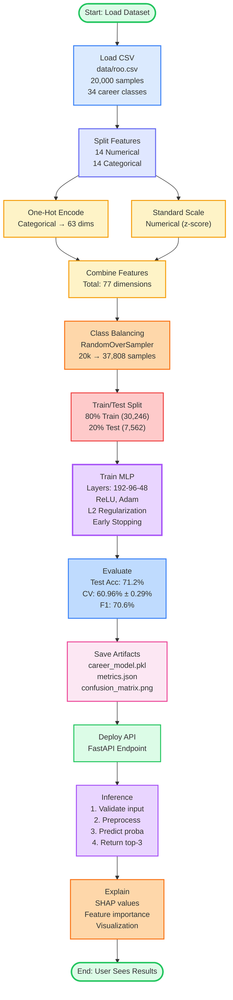
```mermaid
flowchart TD
    %% ML Pipeline - Training to Inference
    
    Start([Start: Load Dataset]) --> Load["Load CSV<br/>data/roo.csv<br/>20,000 samples<br/>34 career classes"]
    
    Load --> Split["Split Features<br/>14 Numerical<br/>14 Categorical"]
    
    Split --> Encode["One-Hot Encode<br/>Categorical → 63 dims"]
    Split --> Scale["Standard Scale<br/>Numerical (z-score)"]
    
    Encode --> Combine["Combine Features<br/>Total: 77 dimensions"]
    Scale --> Combine
    
    Combine --> Balance["Class Balancing<br/>RandomOverSampler<br/>20k → 37,808 samples"]
    
    Balance --> TrainTest["Train/Test Split<br/>80% Train (30,246)<br/>20% Test (7,562)"]
    
    TrainTest --> Train["Train MLP<br/>Layers: 192-96-48<br/>ReLU, Adam<br/>L2 Regularization<br/>Early Stopping"]
    
    Train --> Eval["Evaluate<br/>Test Acc: 71.2%<br/>CV: 60.96% ± 0.29%<br/>F1: 70.6%"]
    
    Eval --> Save["Save Artifacts<br/>career_model.pkl<br/>metrics.json<br/>confusion_matrix.png"]
    
    Save --> Deploy["Deploy API<br/>FastAPI Endpoint"]
    
    Deploy --> Inference["Inference<br/>1. Validate input<br/>2. Preprocess<br/>3. Predict proba<br/>4. Return top-3"]
    
    Inference --> XAI["Explain<br/>SHAP values<br/>Feature importance<br/>Visualization"]
    
    XAI --> End([End: User Sees Results])
    
    style Start fill:#dcfce7,stroke:#22c55e,stroke-width:3px
    style Load fill:#dbeafe,stroke:#3b82f6,stroke-width:2px
    style Split fill:#e0e7ff,stroke:#6366f1,stroke-width:2px
    style Encode fill:#fef3c7,stroke:#f59e0b,stroke-width:2px
    style Scale fill:#fef3c7,stroke:#f59e0b,stroke-width:2px
    style Combine fill:#fef3c7,stroke:#f59e0b,stroke-width:2px
    style Balance fill:#fed7aa,stroke:#f97316,stroke-width:2px
    style TrainTest fill:#fecaca,stroke:#ef4444,stroke-width:2px
    style Train fill:#e9d5ff,stroke:#a855f7,stroke-width:3px
    style Eval fill:#bfdbfe,stroke:#3b82f6,stroke-width:2px
    style Save fill:#fce7f3,stroke:#ec4899,stroke-width:2px
    style Deploy fill:#dcfce7,stroke:#22c55e,stroke-width:2px
    style Inference fill:#e9d5ff,stroke:#a855f7,stroke-width:2px
    style XAI fill:#fed7aa,stroke:#f97316,stroke-width:2px
    style End fill:#dcfce7,stroke:#22c55e,stroke-width:3px
```

---

## 05. Career Prediction Algorithm

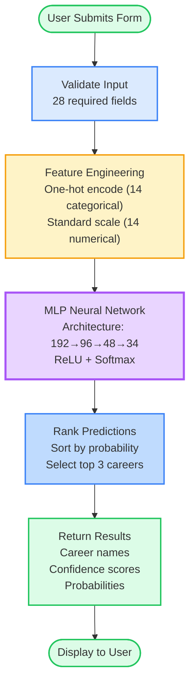
```mermaid
flowchart TD
    %% Career Prediction Algorithm - Balanced Flowchart
    
    Start([User Submits Form]) --> Validate["Validate Input<br/>28 required fields"]
    
    Validate --> Preprocess["Feature Engineering<br/>One-hot encode (14 categorical)<br/>Standard scale (14 numerical)"]
    
    Preprocess --> Model["MLP Neural Network<br/>Architecture: 192→96→48→34<br/>ReLU + Softmax"]
    
    Model --> Rank["Rank Predictions<br/>Sort by probability<br/>Select top 3 careers"]
    
    Rank --> Output["Return Results<br/>Career names<br/>Confidence scores<br/>Probabilities"]
    
    Output --> End([Display to User])
    
    style Start fill:#dcfce7,stroke:#22c55e,stroke-width:2px
    style Validate fill:#dbeafe,stroke:#3b82f6,stroke-width:2px
    style Preprocess fill:#fef3c7,stroke:#f59e0b,stroke-width:2px
    style Model fill:#e9d5ff,stroke:#a855f7,stroke-width:3px
    style Rank fill:#bfdbfe,stroke:#3b82f6,stroke-width:2px
    style Output fill:#dcfce7,stroke:#22c55e,stroke-width:2px
    style End fill:#dcfce7,stroke:#22c55e,stroke-width:2px
```

---

## 06. Career Evolution (Transformer)

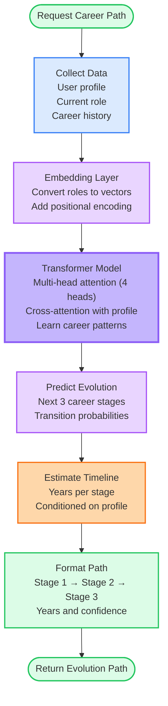
```mermaid
flowchart TD
    %% Career Evolution Algorithm - Balanced Flowchart
    
    Start([Request Career Path]) --> Input["Collect Data<br/>User profile<br/>Current role<br/>Career history"]
    
    Input --> Embed["Embedding Layer<br/>Convert roles to vectors<br/>Add positional encoding"]
    
    Embed --> Transformer["Transformer Model<br/>Multi-head attention (4 heads)<br/>Cross-attention with profile<br/>Learn career patterns"]
    
    Transformer --> Predict["Predict Evolution<br/>Next 3 career stages<br/>Transition probabilities"]
    
    Predict --> Timeline["Estimate Timeline<br/>Years per stage<br/>Conditioned on profile"]
    
    Timeline --> Output["Format Path<br/>Stage 1 → Stage 2 → Stage 3<br/>Years and confidence"]
    
    Output --> End([Return Evolution Path])
    
    style Start fill:#dcfce7,stroke:#22c55e,stroke-width:2px
    style Input fill:#dbeafe,stroke:#3b82f6,stroke-width:2px
    style Embed fill:#e9d5ff,stroke:#a855f7,stroke-width:2px
    style Transformer fill:#c4b5fd,stroke:#8b5cf6,stroke-width:3px
    style Predict fill:#e9d5ff,stroke:#a855f7,stroke-width:2px
    style Timeline fill:#fed7aa,stroke:#f97316,stroke-width:2px
    style Output fill:#dcfce7,stroke:#22c55e,stroke-width:2px
    style End fill:#dcfce7,stroke:#22c55e,stroke-width:2px
```

---

## 07. Resume NLP Pipeline

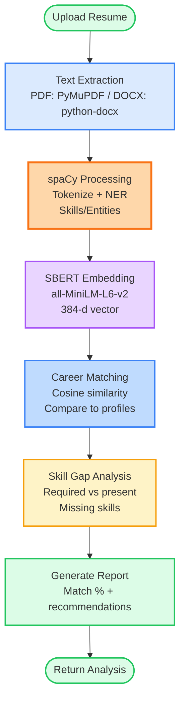
```mermaid
flowchart TD
    %% Resume Analysis NLP Pipeline - Balanced Flowchart
    
    Start([Upload Resume]) --> Extract["Text Extraction<br/>PDF: PyMuPDF / DOCX: python-docx"]
    
    Extract --> NLP["spaCy Processing<br/>Tokenize + NER<br/>Skills/Entities"]
    
    NLP --> Embed["SBERT Embedding<br/>all-MiniLM-L6-v2<br/>384-d vector"]
    
    Embed --> Match["Career Matching<br/>Cosine similarity<br/>Compare to profiles"]
    
    Match --> Gap["Skill Gap Analysis<br/>Required vs present<br/>Missing skills"]
    
    Gap --> Report["Generate Report<br/>Match % + recommendations"]
    
    Report --> End([Return Analysis])
    
    style Start fill:#dcfce7,stroke:#22c55e,stroke-width:2px
    style Extract fill:#dbeafe,stroke:#3b82f6,stroke-width:2px
    style NLP fill:#fed7aa,stroke:#f97316,stroke-width:3px
    style Embed fill:#e9d5ff,stroke:#a855f7,stroke-width:2px
    style Match fill:#bfdbfe,stroke:#3b82f6,stroke-width:2px
    style Gap fill:#fef3c7,stroke:#f59e0b,stroke-width:2px
    style Report fill:#dcfce7,stroke:#22c55e,stroke-width:2px
    style End fill:#dcfce7,stroke:#22c55e,stroke-width:2px
```

---

## 08. XAI Explanation Flow

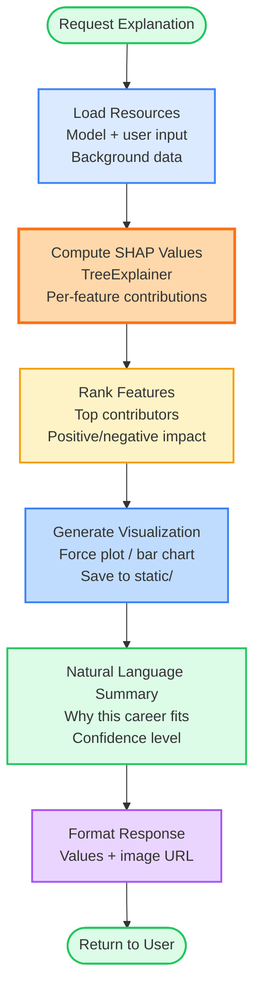
```mermaid
flowchart TD
    %% XAI Explanation Flow - Balanced Flowchart
    
    Start([Request Explanation]) --> Load["Load Resources<br/>Model + user input<br/>Background data"]
    
    Load --> Compute["Compute SHAP Values<br/>TreeExplainer<br/>Per-feature contributions"]
    
    Compute --> Rank["Rank Features<br/>Top contributors<br/>Positive/negative impact"]
    
    Rank --> Visualize["Generate Visualization<br/>Force plot / bar chart<br/>Save to static/"]
    
    Visualize --> Explain["Natural Language Summary<br/>Why this career fits<br/>Confidence level"]
    
    Explain --> Return["Format Response<br/>Values + image URL"]
    
    Return --> End([Return to User])
    
    style Start fill:#dcfce7,stroke:#22c55e,stroke-width:2px
    style Load fill:#dbeafe,stroke:#3b82f6,stroke-width:2px
    style Compute fill:#fed7aa,stroke:#f97316,stroke-width:3px
    style Rank fill:#fef3c7,stroke:#f59e0b,stroke-width:2px
    style Visualize fill:#bfdbfe,stroke:#3b82f6,stroke-width:2px
    style Explain fill:#dcfce7,stroke:#22c55e,stroke-width:2px
    style Return fill:#e9d5ff,stroke:#a855f7,stroke-width:2px
    style End fill:#dcfce7,stroke:#22c55e,stroke-width:2px
```

---

## 09. Data Preprocessing Pipeline

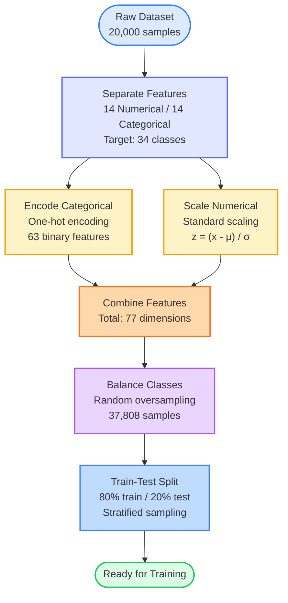
```mermaid
flowchart TD
    %% Data Preprocessing Pipeline - Balanced Flowchart
    
    Start([Raw Dataset<br/>20,000 samples]) --> Separate["Separate Features<br/>14 Numerical / 14 Categorical<br/>Target: 34 classes"]
    
    Separate --> Encode["Encode Categorical<br/>One-hot encoding<br/>63 binary features"]
    
    Separate --> Scale["Scale Numerical<br/>Standard scaling<br/>z = (x - μ) / σ"]
    
    Encode --> Combine["Combine Features<br/>Total: 77 dimensions"]
    Scale --> Combine
    
    Combine --> Balance["Balance Classes<br/>Random oversampling<br/>37,808 samples"]
    
    Balance --> Split["Train-Test Split<br/>80% train / 20% test<br/>Stratified sampling"]
    
    Split --> End([Ready for Training])
    
    style Start fill:#dbeafe,stroke:#3b82f6,stroke-width:2px
    style Separate fill:#e0e7ff,stroke:#6366f1,stroke-width:2px
    style Encode fill:#fef3c7,stroke:#f59e0b,stroke-width:2px
    style Scale fill:#fef3c7,stroke:#f59e0b,stroke-width:2px
    style Combine fill:#fed7aa,stroke:#f97316,stroke-width:2px
    style Balance fill:#e9d5ff,stroke:#a855f7,stroke-width:2px
    style Split fill:#bfdbfe,stroke:#3b82f6,stroke-width:2px
    style End fill:#dcfce7,stroke:#22c55e,stroke-width:2px
```

---

## 10. User Interaction (Activity)

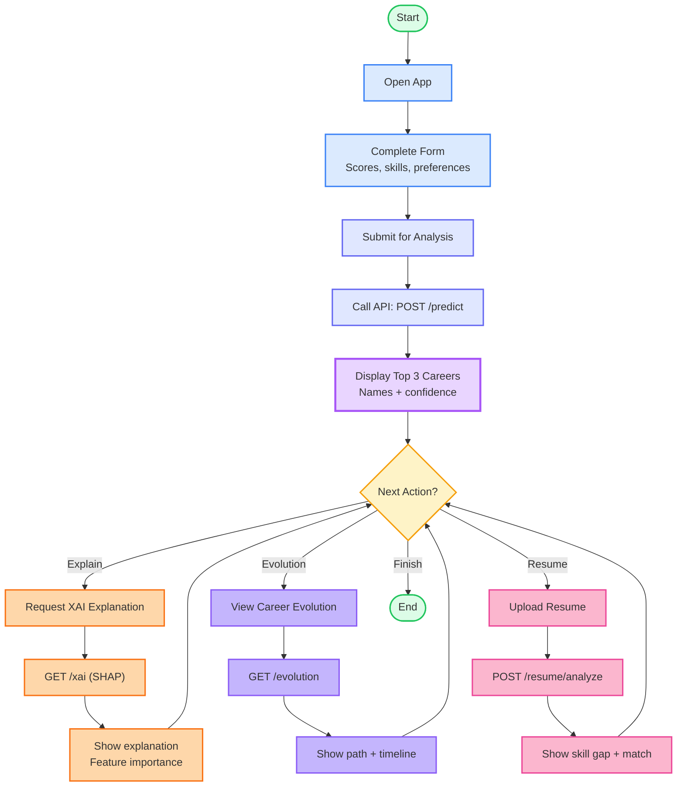
```mermaid
flowchart TD
    %% User Interaction - Activity Diagram (Balanced)
    
    Start([Start]) --> Landing[Open App]
    Landing --> Form[Complete Form<br/>Scores, skills, preferences]
    Form --> Submit[Submit for Analysis]
    Submit --> Predict["Call API: POST /predict"]
    Predict --> Results[Display Top 3 Careers<br/>Names + confidence]
    
    Results --> Choice{Next Action?}
    
    Choice -->|Explain| XAI[Request XAI Explanation]
    XAI --> XAICompute["GET /xai (SHAP)"]
    XAICompute --> XAIShow[Show explanation<br/>Feature importance]
    
    Choice -->|Evolution| Evo[View Career Evolution]
    Evo --> EvoCompute["GET /evolution"]
    EvoCompute --> EvoShow[Show path + timeline]
    
    Choice -->|Resume| Resume[Upload Resume]
    Resume --> ResumeCompute["POST /resume/analyze"]
    ResumeCompute --> ResumeShow[Show skill gap + match]
    
    XAIShow --> Choice
    EvoShow --> Choice
    ResumeShow --> Choice
    
    Choice -->|Finish| End([End])
    
    %% Styling
    style Start fill:#dcfce7,stroke:#22c55e,stroke-width:2px
    style End fill:#dcfce7,stroke:#22c55e,stroke-width:2px
    style Landing fill:#dbeafe,stroke:#3b82f6,stroke-width:2px
    style Form fill:#dbeafe,stroke:#3b82f6,stroke-width:2px
    style Submit fill:#e0e7ff,stroke:#6366f1,stroke-width:2px
    style Predict fill:#e0e7ff,stroke:#6366f1,stroke-width:2px
    style Results fill:#e9d5ff,stroke:#a855f7,stroke-width:3px
    style Choice fill:#fef3c7,stroke:#f59e0b,stroke-width:2px
    style XAI fill:#fed7aa,stroke:#f97316,stroke-width:2px
    style XAICompute fill:#fed7aa,stroke:#f97316,stroke-width:2px
    style XAIShow fill:#fed7aa,stroke:#f97316,stroke-width:2px
    style Evo fill:#c4b5fd,stroke:#8b5cf6,stroke-width:2px
    style EvoCompute fill:#c4b5fd,stroke:#8b5cf6,stroke-width:2px
    style EvoShow fill:#c4b5fd,stroke:#8b5cf6,stroke-width:2px
    style Resume fill:#fbb6ce,stroke:#ec4899,stroke-width:2px
    style ResumeCompute fill:#fbb6ce,stroke:#ec4899,stroke-width:2px
    style ResumeShow fill:#fbb6ce,stroke:#ec4899,stroke-width:2px
```

---

## 11. API Endpoint Architecture

```mermaid
graph TD
    %% API Endpoint Architecture
    
    subgraph Client["Client Applications"]
        Web["Web Browser<br/>React SPA"]
        Mobile["Mobile App<br/>(Future)"]
        style Web fill:#dbeafe,stroke:#3b82f6,stroke-width:2px
        style Mobile fill:#ffffff,stroke:#94a3b8,stroke-width:2px,stroke-dasharray: 5 5
    end
    
    subgraph Gateway["API Gateway Layer"]
        CORS["CORS Middleware<br/>allow_origins: *<br/>allow_credentials: True"]
        Static["Static Files<br/>/static mount<br/>SHAP visualizations"]
        ErrorHandler["Error Handler<br/>HTTP exceptions<br/>Validation errors"]
        style CORS fill:#fef3c7,stroke:#f59e0b,stroke-width:2px
        style Static fill:#fed7aa,stroke:#f97316,stroke-width:2px
        style ErrorHandler fill:#fecaca,stroke:#ef4444,stroke-width:2px
    end
    
    subgraph Endpoints["REST API Endpoints"]
        E1["POST /predict_top3_careers<br/>Input: CareerInput schema<br/>Output: Top3CareerOutput<br/>Handler: predict_top3()"]
        E2["POST /predict_career_evolution<br/>Input: CareerInput + current_role<br/>Output: CareerEvolutionOutput<br/>Handler: predict_evolution()"]
        E3["POST /xai_explanations/{role}<br/>Path: role (string)<br/>Body: CareerInput<br/>Query: generate_visualization<br/>Handler: xai_explanations()"]
        E4["POST /xai_counterfactual/{target_role}<br/>Path: target_role<br/>Body: CareerInput<br/>Query: max_changes<br/>Handler: xai_counterfactual()"]
        E5["POST /parse_resume<br/>Input: UploadFile (PDF/DOCX)<br/>Output: ParsedResumeOutput<br/>Handler: parse_resume()"]
        E6["POST /analyze_resume<br/>Input: Resume + target_career<br/>Output: ResumeAnalysisOutput<br/>Handler: analyze_resume()"]
        E7["GET /model_architecture<br/>Output: Model structure JSON<br/>Handler: get_model_arch()"]
        E8["GET /health<br/>Output: System status<br/>Handler: health_check()"]
        
        style E1 fill:#e9d5ff,stroke:#a855f7,stroke-width:2px
        style E2 fill:#c4b5fd,stroke:#8b5cf6,stroke-width:2px
        style E3 fill:#fed7aa,stroke:#f97316,stroke-width:2px
        style E4 fill:#fcd34d,stroke:#f59e0b,stroke-width:2px
        style E5 fill:#fce7f3,stroke:#ec4899,stroke-width:2px
        style E6 fill:#fbb6ce,stroke:#db2777,stroke-width:2px
        style E7 fill:#bfdbfe,stroke:#3b82f6,stroke-width:2px
        style E8 fill:#dcfce7,stroke:#22c55e,stroke-width:2px
    end
    
    subgraph Services["Service Layer"]
        S1["Model Service<br/>predict_career()<br/>predict_top3_careers()"]
        S2["Evolution Service<br/>predict_evolution_path()<br/>attention_mechanism()"]
        S3["XAI Service<br/>explain_prediction()<br/>generate_counterfactual()"]
        S4["Resume Service<br/>parse_resume()<br/>extract_entities()"]
        S5["Analysis Service<br/>analyze_fit()<br/>skill_gap_analysis()"]
        
        style S1 fill:#e9d5ff,stroke:#a855f7,stroke-width:2px
        style S2 fill:#c4b5fd,stroke:#8b5cf6,stroke-width:2px
        style S3 fill:#fed7aa,stroke:#f97316,stroke-width:2px
        style S4 fill:#fce7f3,stroke:#ec4899,stroke-width:2px
        style S5 fill:#fbb6ce,stroke:#db2777,stroke-width:2px
    end
    
    subgraph Schemas["Pydantic Schemas"]
        Sch1["CareerInput<br/>28 validated fields<br/>Type checking"]
        Sch2["CareerOutput<br/>Prediction response<br/>Confidence scores"]
        Sch3["CareerEvolutionOutput<br/>Evolution stages<br/>Timeframes"]
        
        style Sch1 fill:#fef3c7,stroke:#f59e0b,stroke-width:2px
        style Sch2 fill:#fef3c7,stroke:#f59e0b,stroke-width:2px
        style Sch3 fill:#fef3c7,stroke:#f59e0b,stroke-width:2px
    end
    
    Web --> CORS
    Mobile -.-> CORS
    CORS --> E1
    CORS --> E2
    CORS --> E3
    CORS --> E4
    CORS --> E5
    CORS --> E6
    CORS --> E7
    CORS --> E8
    
    Static --> E3
    ErrorHandler --> E1
    ErrorHandler --> E2
    
    E1 --> Sch1 --> S1
    E2 --> Sch1 --> S2
    E3 --> Sch1 --> S3
    E4 --> Sch1 --> S3
    E5 --> S4
    E6 --> S5
    E7 --> S1
    
    S1 --> Sch2
    S2 --> Sch3
    
    style Client fill:#eff6ff,stroke:#2563eb,stroke-width:3px
    style Gateway fill:#fffbeb,stroke:#d97706,stroke-width:3px
    style Endpoints fill:#faf5ff,stroke:#9333ea,stroke-width:3px
    style Services fill:#fdf2f8,stroke:#db2777,stroke-width:3px
    style Schemas fill:#fefce8,stroke:#ca8a04,stroke-width:3px
```

---

## 12. Hardware Components

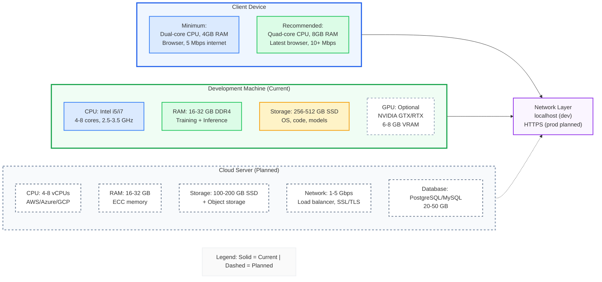
```mermaid
graph LR
    %% Hardware Component Specifications - Simplified
    
    subgraph Dev["Development Machine (Current)"]
        D1["CPU: Intel i5/i7<br/>4-8 cores, 2.5-3.5 GHz"]
        D2["RAM: 16-32 GB DDR4<br/>Training + Inference"]
        D3["Storage: 256-512 GB SSD<br/>OS, code, models"]
        D4["GPU: Optional<br/>NVIDIA GTX/RTX<br/>6-8 GB VRAM"]
        
        style D1 fill:#dbeafe,stroke:#3b82f6,stroke-width:2px
        style D2 fill:#dcfce7,stroke:#22c55e,stroke-width:2px
        style D3 fill:#fef3c7,stroke:#f59e0b,stroke-width:2px
        style D4 fill:#ffffff,stroke:#94a3b8,stroke-width:2px,stroke-dasharray: 5 5
    end
    
    subgraph Client["Client Device"]
        C1["Minimum:<br/>Dual-core CPU, 4GB RAM<br/>Browser, 5 Mbps internet"]
        C2["Recommended:<br/>Quad-core CPU, 8GB RAM<br/>Latest browser, 10+ Mbps"]
        
        style C1 fill:#dbeafe,stroke:#3b82f6,stroke-width:2px
        style C2 fill:#dcfce7,stroke:#22c55e,stroke-width:2px
    end
    
    subgraph Prod["Cloud Server (Planned)"]
        P1["CPU: 4-8 vCPUs<br/>AWS/Azure/GCP"]
        P2["RAM: 16-32 GB<br/>ECC memory"]
        P3["Storage: 100-200 GB SSD<br/>+ Object storage"]
        P4["Network: 1-5 Gbps<br/>Load balancer, SSL/TLS"]
        P5["Database: PostgreSQL/MySQL<br/>20-50 GB"]
        
        style P1 fill:#ffffff,stroke:#64748b,stroke-width:2px,stroke-dasharray: 5 5
        style P2 fill:#ffffff,stroke:#64748b,stroke-width:2px,stroke-dasharray: 5 5
        style P3 fill:#ffffff,stroke:#64748b,stroke-width:2px,stroke-dasharray: 5 5
        style P4 fill:#ffffff,stroke:#64748b,stroke-width:2px,stroke-dasharray: 5 5
        style P5 fill:#ffffff,stroke:#64748b,stroke-width:2px,stroke-dasharray: 5 5
    end
    
    Client --> Network["Network Layer<br/>localhost (dev)<br/>HTTPS (prod planned)"]
    Dev --> Network
    Prod -.-> Network
    
    style Dev fill:#f0fdf4,stroke:#16a34a,stroke-width:3px
    style Client fill:#eff6ff,stroke:#2563eb,stroke-width:3px
    style Prod fill:#f8fafc,stroke:#94a3b8,stroke-width:3px,stroke-dasharray: 5 5
    style Network fill:#faf5ff,stroke:#9333ea,stroke-width:2px
    
    Legend["Legend: Solid = Current | Dashed = Planned"]
    style Legend fill:#fafafa,stroke:#e5e7eb,stroke-width:1px
```
